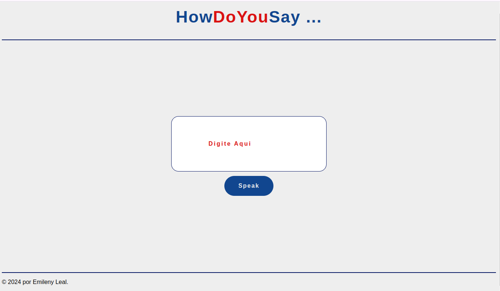
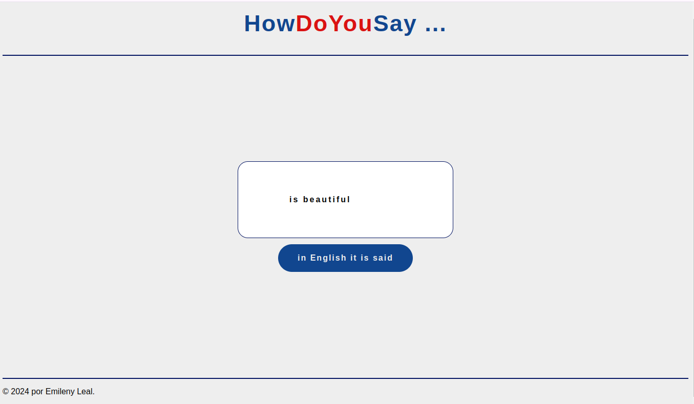

# howdoyousay

<h2>Sobre o projeto<h2>
O objetivo do projeto foi criar uma aplicação que retorna ao o usuário como se diz algo em inglês. Usando tecnologias como html, css, javaScript, além de consumir uma api de voice

## Layout do projeto
 

## Tecnologias ultilizadas

 - HTML
 - CSS
 - JS
